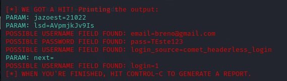
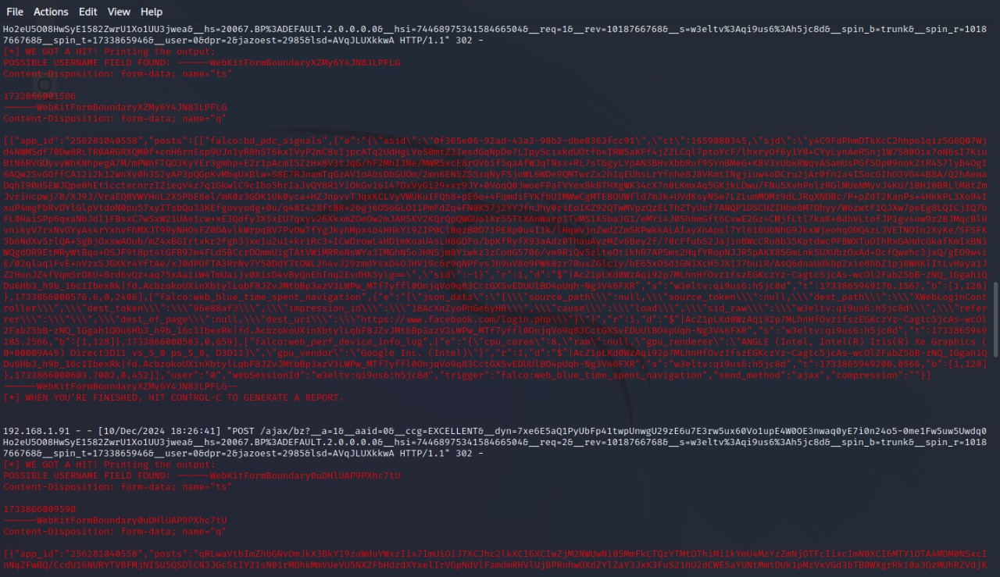
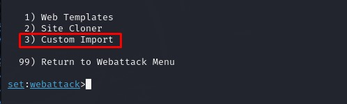
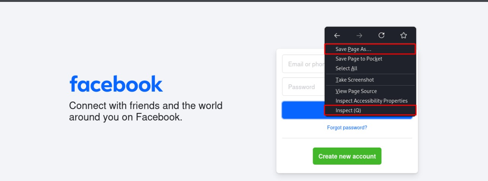
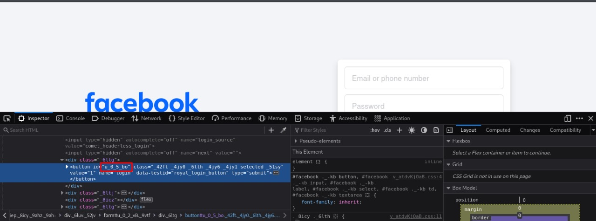
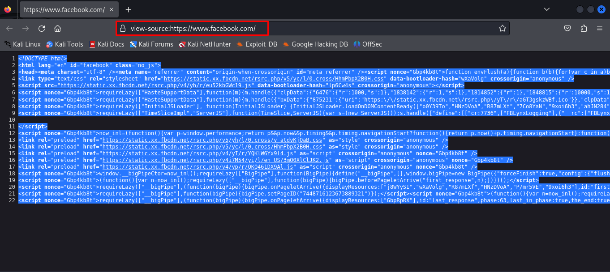
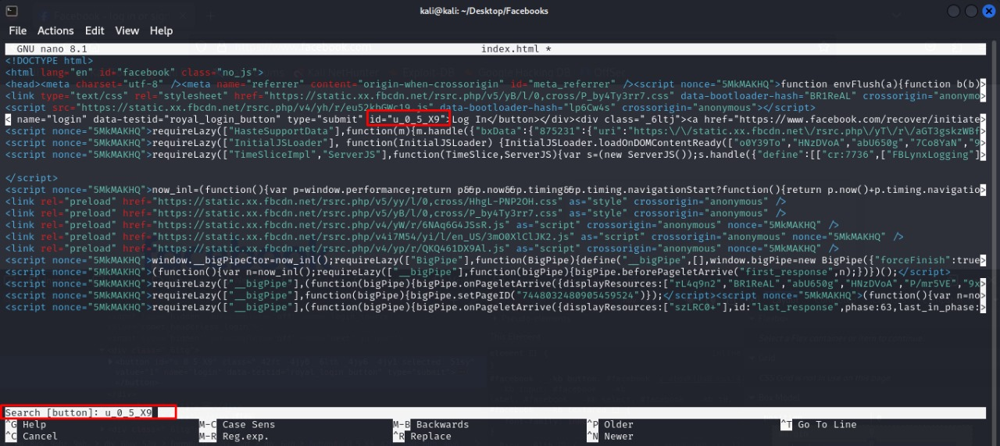
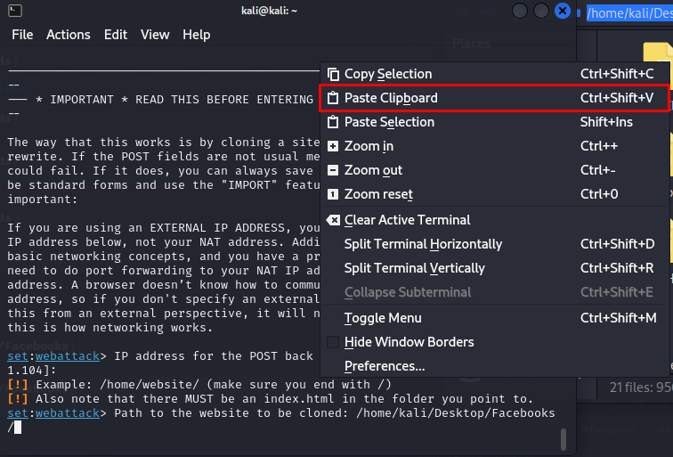
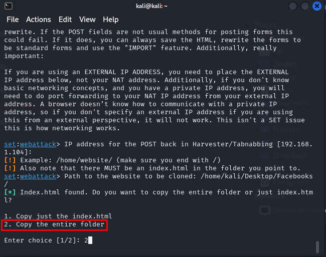
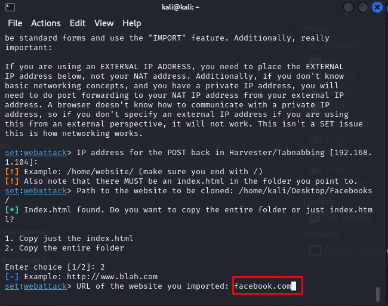

# BOOTCAMP SANTANDER DIO

## Phishing Captura de Senhas Facebook

### Ferramentas

- Kali Linux
- setoolkit

### Configurando o Phishing no Kali Linux

- Acesso root: ``` sudo su ```
- Iniciando o setoolkit: ``` setoolkit ```
- Tipo de ataque: ``` Social-Engineering Attacks ```
- Vetor de ataque: ``` Web Site Attack Vectors ```
- Método de ataque: ```Credential Harvester Attack Method ```
- Método de ataque: ``` Site Cloner ```
- Obtendo o endereço da máquina: ``` ifconfig ```
- URL para clone: https://www.facebook.com

### Resutados (Versão sem Defesa)



### Defesa Facebook
->Observe abaixo que atualmente o site do Facebook possui uma proteção contra script maliciosos. 



### Alternativa contra defesa
->Uma possibilidade de resolução do caso, está no próprio ```setoolkit``` onde se pode realizar ```Custon Import```. Nesta opção iremos realizar uma clonagem e em seguida uma pequena edição no código fonte  original. 



### Salvar página e ID button

->Na página original, iremos salvar a página com o nome ```index.html``` e em seguida iremos inspecionar o botão ```Log In```. 



->Em seguida iremos identificar o button ID. 



### Editando código fonte

->Em seguida iremos copiar o código fonte do site 'www.facebook.com' e colar no nosso arquivo ```index.html```



->Agora no código fonte iremos identificar em qual script o ```button ID``` está sendo chamado e em seguida apagar.



->Em seguida no ```setoolkit``` iremos selecionar a opção ```Custom Import``` e apontar para a pasta onde o código fonte manipulado se encontra.

->Copie o diretorio da pasta onde se localiza o código fonte manipulado.

->Cole o diretório no setoolkit. 



->Selecione ```Copy the entire folder```



->Em seguida defina a ```URL``` do site importado.



## Resultado após aplicação do método contra a defesa


